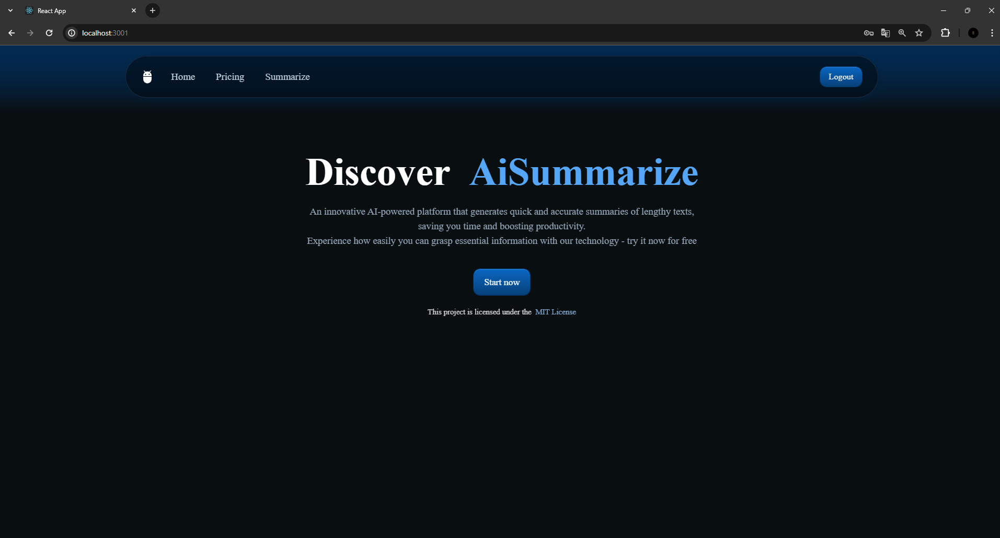

# 🤖 AiSummarize - AI-Powered Document Summarization



The application I've developed is a monolithic SaaS system that facilitates easy uploading of PDF files. It utilizes
artificial intelligence to automatically condense documents by extracting essential information, providing users with
quick access to key content

## 📖 Table of Contents

1. [Introduction](#introduction)
2. [Project Status](#projectStatus)
3. [Requirements](#requirements)
4. [Installation](#installation)
5. [Running](#running)
6. [Features](#features)
7. [Demo](#demo)
8. [Documentation](#documentation)
9. [Contributing](#contributing)
10. [Technologies](#Technologies)
11. [License](#license)

## 🌟 Introduction

AiSummarize simplifies the process of summarizing PDF documents by leveraging AI technology. Users can upload PDF files,
which are then processed to generate concise summaries. Additionally, the application incorporates styling enhancements
using CSS for an improved user experience.

## 🚧 Project Status

Still in progress.
The application is continuously being developed and improved. Tasks and progress can be tracked in
the [GitHub/project](https://github.com/users/marcinlewinski/projects/3) available in this repository.

## 📋 Requirements

- Java 17 or later
- Maven
- Node.js
- Docker
- Docker Compose

## 🛠️ Installation

1. Clone the repository: `git clone https://github.com/marcinlewinski/AiSummarize`
2. Navigate to the project directory: `cd AiSummarize`
3. Create a .env file in the project root directory with the following content:

 ```properties
POSTGRES_PASSWORD=YOUR_PASSWORD
KEYCLOAK_DB_PASSWORD=YOUR_PASSWORD_KEYCLOAK_DB
KEYCLOAK_ADMIN_PASSWORD=YOUR_KEYCLOAK_ADMIN_PASSWORD
MYSQL_ROOT_PASSWORD=YOUR_MSQL_PASSWORD
REACT_APP_KEYCLOAK_URL=http://localhost:8180
REACT_APP_KEYCLOAK_REALM=AiSummarize
REACT_APP_KEYCLOAK_CLIENT=AiSummarize-client
REACT_APP_BASE_URL=http://localhost:8080
 ```

5. Build the Docker images and start the containers: `docker-compose up --build`

## ⚙️ Running

Once the Docker containers are up and running, the application will be accessible at the specified ports for the backend
and frontend.

## ✨ Features

- [x]  **PDF Upload**: Users can upload PDF files for summarization.
- [x]  **Styling**: CSS is used to enhance the frontend interface.
- [x]  **User Authentication**: Login using Keycloak for secure access to the application.
- [x]  **Docker Compose**: Easily deploy and run the application using Docker Compose.
- [ ]  **Summarization**: In progress. AI technology generates summarized versions of uploaded PDF documents.
- [ ]  **Payments**: In progress. Payment processing functionality will be added.

## 🎥 Demo
|             Main view              |
|:----------------------------------:|
|  |

|                    Summarize                     |                 Upload                 |
|:------------------------------------------------:|:--------------------------------------:|
|  |  |

|                   Pricing                    |                 Keycloak                 |
|:------------------------------------------:|:----------------------------------------:|
|  |  |


## 📖 Documentation

No full documentation in this README file. For details, please ask the author or check the source code.

## 👥 Contributing

Contributions are welcome! If you'd like to contribute to AiSummarize, please fork the repository and create a pull
request.

## 🛠️ Technologies

- 🚀 Java 17: Programming language for backend development.
- ⚙️ Spring Boot: Framework for building Java applications.
- 📊 Spring Data: Provides data access and manipulation tools for Spring applications.
- 🔐 Spring Security + Keycloak: Security framework for authentication and access control. Keycloak is used for identity
  and access management.
- 🐘 PostgreSQL: Relational database management system used for keycloak data storage.
- 🖼️ MySql: Relational database management system used for .pdf data storage.
- 🛠️ Maven: Build automation tool used for managing dependencies and building the project.
- 🟩 Node.js: JavaScript runtime environment for running JavaScript code outside of a web browser, used for frontend
  development.
- ⚛️ React.js: JavaScript library for building user interfaces.
- 🗄️ Hibernate: Object-relational mapping (ORM) framework for mapping an object-oriented domain model to a relational
  database.
- 🐳 Docker: Platform for developing, shipping, and running applications in containers.
- 🐳🧩 Docker Compose: Tool for defining and running multi-container Docker applications.
- 🧪 JUnit 5: Framework for writing and running tests in Java.

## 📜 License

This project is licensed under the [MIT](https://choosealicense.com/licenses/mit/) License.
